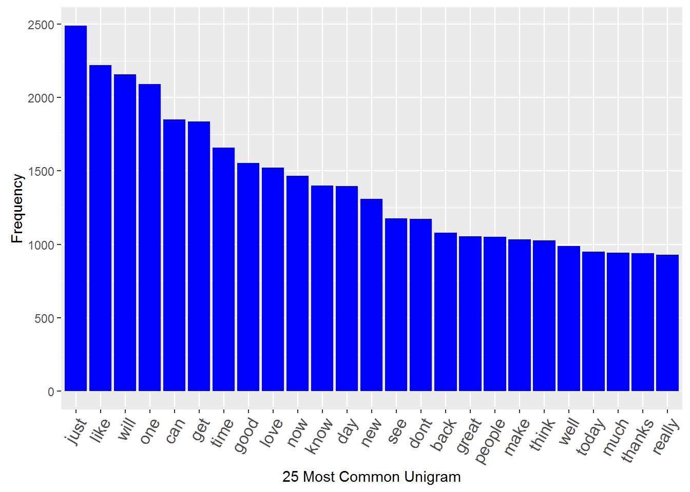
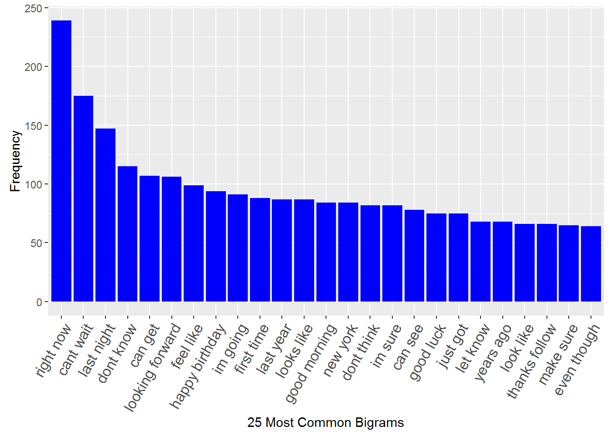

```{r setup, include=FALSE}
knitr::opts_chunk$set(echo = TRUE)
```

## Introduction

This is the Milestone Report for the Coursera Data Science Capstone project. The goal of the capstone project is to create a predictive text model using a large text corpus of documents as training data. Natural language processing techniques will be used to perform the analysis and build the predictive model.

This milestone report describes the major features of the training data with our exploratory data analysis and summarizes our plans for creating the predictive model.


## Dataset and basic summaries

The data can be downloaded from [a link given in the course website](https://d396qusza40orc.cloudfront.net/dsscapstone/dataset/Coursera-SwiftKey.zip). For each language it contains three sets: blogs, news and twitter. For the purpose of this exercise we will focus on the data in the 'en_US' folder only.

```{r installLibraries}
# Preload necessary R librabires
library(dplyr)
library(doParallel)
library(stringi)
library(tm)
library(slam)
library(ggplot2)
library(wordcloud)

# Setup parallel clusters to accelarate execution time
jobcluster <- makeCluster(detectCores())
invisible(clusterEvalQ(jobcluster, library(tm)))
invisible(clusterEvalQ(jobcluster, library(slam)))
invisible(clusterEvalQ(jobcluster, library(stringi)))
invisible(clusterEvalQ(jobcluster, library(wordcloud)))
```


```{r loadData}
blogs <- readLines(con <- file ("data/en_US/en_US.blogs.txt", encoding = "UTF-8"))
close(con) 
news <- readLines(con <- file ("data/en_US/en_US.news.txt", encoding = "UTF-8"))
close(con) 
tweets <- readLines(con <- file ("data/en_US/en_US.twitter.txt", encoding = "UTF-8"))
close(con) 
```

## Basic Statistics

We examined the data sets and summarize our findings (file sizes, line counts, word counts, and mean words per line) below.

```{r computeBasicStats}

# Compute words per line info on each line for each data type
rawWPL<-lapply(list(blogs,news,tweets),function(x) stri_count_words(x))

# Compute statistics and summary info for each data type
rawstats<-data.frame(
            File=c("blogs", "news", "tweets"),
            t(rbind(sapply(list(blogs,news,tweets),stri_stats_general),
            TotalWords=sapply(list(blogs,news,tweets),stri_stats_latex)[4,])),
            # Compute words per line summary
            WPL=rbind(summary(rawWPL[[1]]),summary(rawWPL[[2]]),summary(rawWPL[[3]]))
            )
print(rawstats)

```

## Getting clean data

Before performing exploratory analysis, we must clean the data first. This involves removing URLs, special characters, punctuations, numbers, excess whitespace, stopwords, and changing the text to lower case. Since the data sets are quite large, we only chose a sample from each set, first 10000 lines.

```{r loadCleanSample, eval=FALSE}
sampledDocs <- sample(paste(blogs, news, tweets), size = 1000, replace = TRUE)
documents <- Corpus(VectorSource(sampledDocs))
documents <- tm_map(documents, function(x) iconv(x, to='UTF-8', sub='byte'))
documents <- tm_map(documents, content_transformer(tolower))
documents <- tm_map(documents, stripWhitespace)
documents <- tm_map(documents, removePunctuation)
documents <- tm_map(documents, removeNumbers)

dtMatrix <- DocumentTermMatrix(documents, control = list(wordLengths = c(0, Inf)))
#dtMatrix <- DocumentTermMatrix(documents)

#convert to a data frame
dtFrame <- as.data.frame(as.matrix(dtMatrix))

#unique words
dim(dtFrame)[2]

```


```{r moreAnalysis, echo=FALSE}
# qplot(sampledDocs, geom="histogram", main="Histogram for US Blogs",
#       xlab="No. of Words", ylab="Frequency", binwidth=10)

#set.seed(2803)
#wordcloud(colnames(dtFrame),colSums(dtFrame), scale = c(2, 0.25))
# wordcloud(words = colnames(dtMatrix), freq = col_sums(dtMatrix),
# scale = c(3, 1),
#    max.words = 100, random.order = FALSE,
# rot.per = 0.35,
#    use.r.layout = FALSE #, colors = brewer.pal(8, "Dark2")
#    )

```

## Exploratory Analysis

Here is a histogram of the 25 most common unigram in the data sample.
```{r, eval=FALSE}
createPlot(freq1, "25 Most Common Unigram")
```


Next historam shows the 25 most common bigrams in the data sample.

```{r, eval=FALSE}
createPlot(freq2, "25 Most Common Bigrams")
```

